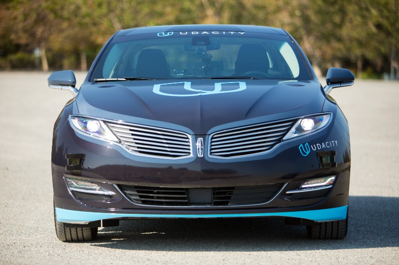

# [Self Driving Car Engineer Nanodegree Udacity](https://github.com/udacity/self-driving-car)

This course is diving into six parts:
 - Part I   : Detection algorithms to detect Lanes and Cars 
 - Part II  : Sensor fusion, Localisation and control
 - Part III : Planning, Advanced Deep Learning, Safety & Gaurantees and ROS
 - Part IV  : Resume and Job Search
 - Part V   : Profile Review
 - Part VI  : Data Structures and Algorithms

Each part has multiple projects that utilize the concepts learned in the modules of that part. The aim of this course is to enable learners to identify and solve real world problems arising in the Self Driving Car technology. 

## Part I

### Classical Computer Vision
 - Project - [Finding Lane Lines](https://github.com/dhruv2603/Udacity-Self-Driving-Car-Nanodegree-Program/tree/main/CarND-LaneLines-P1)
    - In this project lane markings on the road are identified using the fundamental concepts of edge detection, color selection and region selection.

Computer Vision, Deep Learning, and Sensor Fusion
Here, I first become an expert in applying Computer Vision and Deep Learning on automotive problems. I will teach the car to detect lane lines, predict steering angle, and more all based on just camera data, along with working with lidar and radar data.