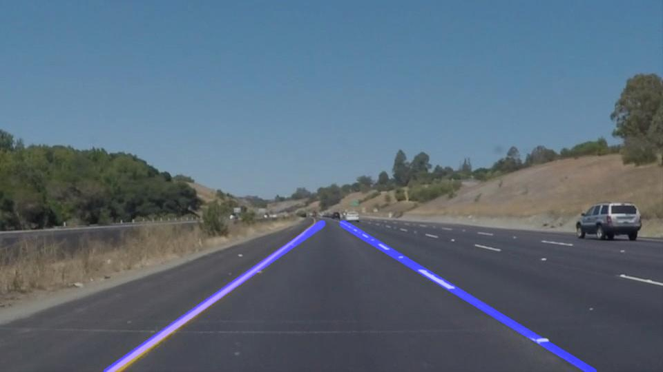

# **Finding Lane Lines on the Road** 

## Overview

When we drive, we use our eyes to decide where to go.  The lines on the road that show us where the lanes are act as our constant reference for where to steer the vehicle.  Naturally, one of the first things we would like to do in developing a self-driving car is to automatically detect lane lines using an algorithm.

---

**Finding Lane Lines on the Road**

The most basic detection technique in Computer Vision is Edge detection. This fundamental technique is the most important aspect in detecting the lanes on road. We also use the Hough transformation to seprate the relevant edges from random edges. The complete lane detection pipeline is as follows:

- Define a mask to select white color in the image
- Define a yellow mask to select yellow color in the image
- Convert the image to grayscale
- Apply Gaussian Blur to the grayscale image
- Use Canny transform to detect edges
- Select a region of interest inside which the lanes are expected to be found
- Apply Hough transform and filter out the important edges of the lane markings
- Draw the lanes on top of the original image
- Repeat the entire process for each image in a video

    ![Grayscale image][image1]

[//]: # (Image References)

[image1]: ./examples/grayscale.jpg "Grayscale"

---

### Modifying the striped lane to a continuous lane

To to this, first the left lane and right lane were identified. This was simply done by checking whether the coordinate lies in the left half of the image ir the right half. Now for all the points in the image cooresponding to the left lane, the x-coordinate and y-coordinate were appended into separate lists. They were then passed to an OpenCV function 'cv2.polyfit' which fits these points to a line and gives the slope and y-intercept of the line. From the region of interest we know the highest and lowest y-coordinate inside it. Using equation of a line we calculate the x-xoordinate for both the extremes and then draw a line between the coordinates. We repeat the same process for the right lane.

### 2. Potential shortcomings of the Pipeline

This approach has many shorcomings. The algorithm assumes that:
- The lighting in the environment will remain constant throughout
- The lane markings will always be present and will be in pristine condition with no wear and tear
- There would not be any other object of similar color inside the region of interest (eg. cars)
- The road would not curve much such that the lane appears stright instead of a curved shape

### 3. Possible improvements

The first improvement would be to detect curved lines instead of straight lines using a higher order fit in the 'cv2.polyfit' function. It is possible that cars might be present inside the region of interest and the edges of the cars might be wrongly detected as lanes.

In the era of deep learning, we can use detection models to detect cars, lanes, people etc. and segment them in the image, however these methods require an exhaustive collection of training data of diverse scenarios.
